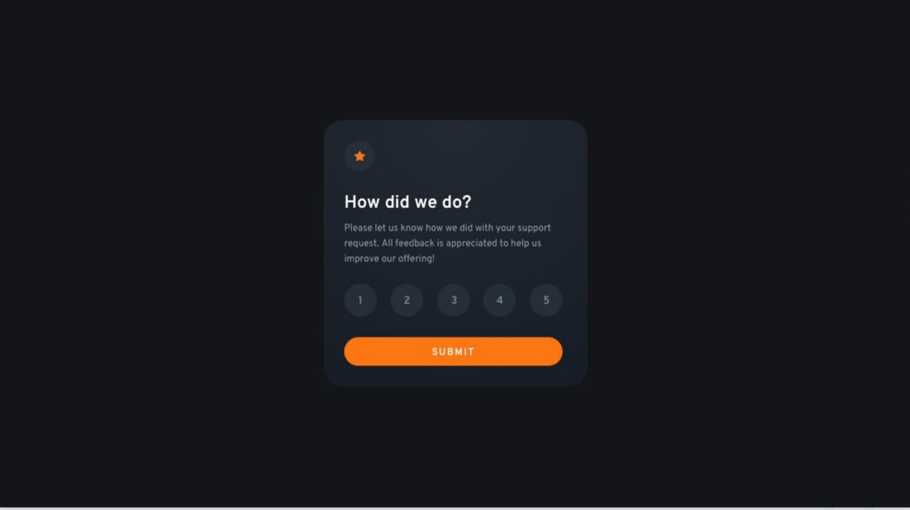

# Rating app

## Hi! 👋

This is a reactjs coding challenge.

**To do this challenge, you need a basic understanding of HTML, CSS, JavaScript, and ReactJS.**

## The challenge

Your challenge is to build out this Rating app and get it looking as close to the design as possible.

You must use the following tools to help you complete the challenge

- [NextJS](https://nextjs.org/docs/getting-started)
- Any CSS framework you are comfortable with, So if you've got something you'd like to practice, feel free to give it a go. But I recommend [Tailwindcss](https://tailwindcss.com/)

Users should be able to:

- View the optimal layout for the app depending on their device's screen size
- See hover states for all interactive elements on the page
- Select and submit a number rating
- See the "Thank you" card state after submitting a rating

## Where to find everything

The task is to build out the project to the designs inside the `/design` folder. You will find both a mobile and a desktop version of the design.

The designs are in JPG static format. Using JPGs will mean that you'll need to use your best judgment for styles such as `font-size`, `padding` and `margin`.

You will find all the required assets in the `/images` folder. The assets are already optimized.

There is also a `style-guide.md` file containing the information you'll need, such as color palette and fonts.

## Building your project

Feel free to use any workflow that you feel comfortable with. Below is a suggested process, but do not feel like you need to follow these steps:

1. Look through the designs to start planning out how you'll tackle the project. This step is crucial to help you think ahead for CSS classes to create reusable styles.
2. Before adding any styles, structure your content with HTML. Writing your HTML first can help focus your attention on creating well-structured content.
3. Write out the base styles for the project, including general content styles, such as `font-family` and `font-size`.

## Deploying your project

- We will look into this later

**Have fun building!** 🚀
